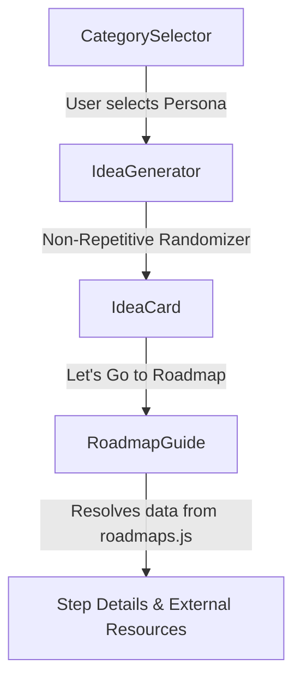

# MindSparks ⚡

[](https://react.dev/)
[](https://reactrouter.com/)
[](LICENSE)
[](https://github.com/gitxpriyanshu)

**MindSparks** is an interactive, client-side ideation engine designed for content creators, developers, designers, and entrepreneurs. It instantly generates tailored content/project ideas across 20+ specialized creator personas and couples them with structured step-by-step implementation roadmaps and direct documentation resources.

---

## 2. Overview

### The Problem
Creators and developers often suffer from "blank canvas syndrome"—the friction of having no inspiration combined with the lack of a clear, actionable starting path once they finally find an idea. 

### The Solution
**MindSparks** bridges the gap between raw inspiration and technical execution. By choosing a specific creator persona, users are served high-quality, randomized prompts that can be instantly mapped to deep, step-by-step development roadmaps containing real-world external resources (such as Google APIs, TensorFlow.js, AWS S3, etc.).

---

## 3. Features

*   **20+ Specialized Creator Personas:** Ranging from Software Developers and UI/UX Designers to YouTube Creators, Fitness Coaches, and Molecular Chefs.
*   **Duplicate-Resistant Randomization:** Algorithmic idea picker that generates 3 high-impact ideas at a time, checking against a history queue of recently used indexes to prevent immediate repetition.
*   **Actionable Roadmaps:** Clicking any idea routes the user to a dedicated project manager board displaying an execution roadmap, step descriptions, and API guides.
*   **Curated Resource Index:** Maps recommended tools, APIs, and frameworks straight to official developer portals or search queries.

---

## 4. Tech Stack

*   **Core UI:** [React 19](https://react.dev/) (Functional components, hooks, local state preservation)
*   **Routing:** [React Router v7](https://reactrouter.com/) (Declarative client-side SPAs, dynamic URL parameters)
*   **Design System:** CSS3 Vanilla Design Tokens (interactive card flips, responsive flex-grids, modern dark theme styling)
*   **Package Management:** NPM & Webpack (via CRA build suite)

---

## 5. Architecture & Workflow

MindSparks is built as a modular client-side Single Page Application (SPA):



All idea pools (`ideaData.js`) and structural roadmaps (`roadmaps.js`) are modeled as static datasets, enabling lightning-fast performance, offline capabilities, and zero API cold starts.

---

## 6. Project Structure

```bash
src/
├── components/
│   ├── CategorySelector.jsx  # Persona navigation grid
│   ├── IdeaGenerator.jsx     # Non-repetitive idea generator logic
│   ├── IdeaCard.jsx          # Interactive flip-card rendering
│   └── RoadmapGuide.jsx      # Detail guide page & dynamic resource mapper
├── ideaData.js               # Structured dataset of 200+ idea prompts
├── roadmaps.js               # Comprehensive implementation roadmaps
├── styles.css                # Base stylesheets and responsive layout grid
├── App.js                    # Router configuration & root controller
└── index.js                  # DOM mounting and bundle initialization
```

---

## 7. Installation & Setup

Ensure you have [Node.js](https://nodejs.org/) installed (v18+ recommended).

```bash
# 1. Clone the repository
git clone https://github.com/gitxpriyanshu/MindSparks.git
cd MindSparks

# 2. Install package dependencies
npm install

# 3. Spin up the development server
npm run dev
```

---

## 8. Environment Variables

MindSparks runs entirely client-side. No environment variables (`.env`) are required for the base application. 

---

## 9. API Endpoints

This is a **client-side only application**. There are no active backend API endpoints. All data resolves synchronously from local React state.

---

## 10. Usage

1.  **Launch the App:** Open the homepage to see 20+ specialized creator icons.
2.  **Generate Ideas:** Select a persona (e.g., *Developer*) and click **Generate Ideas** to see three non-repeating cards.
3.  **Read Actionable Guide:** Click **Let's go to the Roadmap Page** on any card to see its structural stages, implementation strategies, and external API resources.

---

## 11. Deployment

To generate a fully optimized, static production bundle:

```bash
npm run build
```
This outputs production-ready HTML, optimized JS, and minified CSS assets into the `build/` directory, suitable for Vercel, Netlify, or GitHub Pages.

---

## 12. Performance & Security

*   **Algorithmic Optimization:** Idea rendering runs at $O(1)$ lookup speed with memory-capped array slicing for duplication history.
*   **Security Posture:** 100% client-side execution eliminates server injection attack vectors. All outbound links use `rel="noopener noreferrer"` to prevent reverse tab-nabbing vulnerabilities.

---

## 13. Roadmap

- [x] Non-repetitive generator algorithm
- [x] 20 Creator categories and data structures
- [ ] LocalStorage caching for generated ideas
- [ ] Light / Dark mode UI toggle
- [ ] Export roadmaps to Markdown/PDF format

---

## 14. Contributors

*   **Priyanshu (@gitxpriyanshu)** - Technical Architect & Core Maintainer

---

## 15. License

Distributed under the MIT License. See [LICENSE](LICENSE) for more information.

---

## 16. Contact

*   **Priyanshu** - [gitxpriyanshu](https://github.com/gitxpriyanshu)
*   **Project Link:** [https://github.com/gitxpriyanshu/MindSparks](https://github.com/gitxpriyanshu/MindSparks)

---

<p align="center">
  Built with engineering precision by <a href="https://github.com/gitxpriyanshu">gitxpriyanshu</a>
</p>
